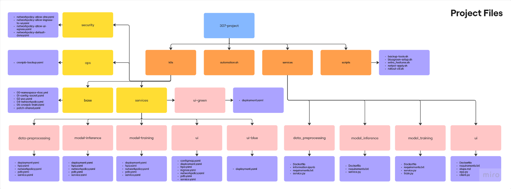

# NeuroNova Project ReadMe - Kubernetes

## Project Details & Objective

This `README.md` file conveys every single aspect of this Kubernetes Project with the main Project objective in mind is to deploy an end to end AI Application in Kubernetes for Diabetes Detection. 

In the real world scenarios, this project can be proved to be a crucial aspect in hospitals:


1. **Early and Proactive Healthcare**: A reliable diabetes prediction tool can help identify individuals at high risk of developing the disease. This allows for early intervention through lifestyle changes, diet modifications, and preventative medical care, potentially delaying or even preventing the onset of diabetes.

2. **Reduced Healthcare Costs**: Early detection and prevention of chronic diseases like diabetes can significantly reduce long-term healthcare costs for both individuals and the healthcare system as a whole. Fewer complications and hospitalizations lead to lower medical expenses.

3. **Scalable and Reliable Health Tech**: The use of a microservices architecture and Kubernetes for deployment means the application can be scaled to handle a large number of users and is resilient to failures. This is crucial for real-world healthcare applications that need to be highly available and reliable.

---

## Kubernetes 

Kubernetes is used to run our application, making it reliable, scalable, and easy to manage. Instead of running our code on a single machine, Kubernetes orchestrates multiple "containers" to work together seamlessly. Coupled with Docker, the orchestration by Kubernetes provides a symphonic harmony in allowing for the Application to be **reliable**, **scalable** & **modular**. 

The Architecture of our project is what is shown in the image:


**The Architecture had proven to be robust through the following ways:**
1. User Access: A user sends a request to our application from their browser over the internet.

2. Ingress Routing: The request first hits the Ingress Controller, which acts as the main entry point to our system. It securely routes the traffic to the correct service, which in this case is our User Interface (UI).

3. Frontend Service (UI): The request is forwarded to the UI Service, which manages and distributes the load across multiple running copies (Pods) of our UI application. This ensures the frontend is always available and responsive.

4. Backend Service (Model Inference): To make a prediction, the UI application communicates with the Model Inference Service. This backend service also manages multiple Pods, each capable of running our trained machine learning model to predict diabetes based on the data provided.

5. Shared Storage: All the different parts of our application are connected to a Shared Persistent Volume. This is where we store our dataset, the trained machine learning models, and backups. This ensures that all components have consistent access to the data they need.

6. Automated Tasks: We run two automated jobs on a nightly schedule:

7. Nightly Retrain: This job automatically retrains our ML model with new data to improve its accuracy over time.

8. Nightly Backup: This job creates a backup of our models and data to prevent data loss

## Kubernetes Modules: 

##### Universal Files across all modules:
1. **requirements.txt**:
    - Defines Python dependencies required by the UI.
    - Ensures reproducibility & consistency across environments. 
2. **Dockerfile**:
    - Specifies how the Container should be built through a lightweight Python base image. 
    - Enables Kubernetes to run the UI as an isolated, reproducible container. 

A kubernetes architecture has to be modular, therefore we have intelligently split the entire project into different modules, allowing each module to be scaled, rolled out and more independently. 

The modules that we have split into are: 


1. ### User-Interface (UI):

    - The UI Module serves as the front foor of the Kubernetes Project, providing a seamless way for users to interact with the deployed application. 
    - Kubernetes has full control of the orchestration of this module, containerised by Docker, designed for scalability, reliability and security in mind. 

    #### CORE COMPONENTS:

    ##### Python Files:
    1. **app.py**:
        - Serves as the main entry point to the UI Service.
        - Developed with Streamlit and FastAPI
        - Handles the routing of the HTTPS requests and integrates with backend services.
    2. **client.py**:
        - Acts as a connector between UI & Model Inference Service 
        - Sends requests to the model-inference-svc and retrieves predictions of the model. 

    ##### Kubernete Manifests (yaml):
    UI's related manifests are located under `k8s/services/ui` except the u-blue and ui-green
    1. **Deployment.yaml**:
	    -	Defines the UI pod specification.
	    -	Includes:
	    -	Container image (built from the Dockerfile).
	    -	Resource requests/limits (CPU & memory).
	    -	Probes (livenessProbe, readinessProbe) for health checks.
	    -	Environment variables (from ConfigMap).
	2.	**service.yaml**
	    -   Exposes the UI pod internally within the Kubernetes cluster.
	    -	Type: ClusterIP (internal service) or paired with Ingress for external access.
	    -	Provides stable DNS (ui) so other services (like ingress controller) can reach it.
	3.	**ingress.yaml**:
	    -	Handles external access to the UI via HTTP/HTTPS.
	    -	Routes traffic from outside the cluster to the UI service.
	    -	Can integrate with an ingress controller (e.g., NGINX) and TLS certificates for HTTPS.
	4.	**hpa.yaml (Horizontal Pod Autoscaler)**:
	    -	Ensures scalability of the UI service.
	    -   Monitors metrics (e.g., CPU usage).
	    -	Automatically adjusts the number of UI pods between defined min/max replicas.
	5.	**pdb.yaml (Pod Disruption Budget)**
	    -	Protects the UI from downtime during voluntary disruptions (node drain, upgrades).
	    -	Ensures at least one replica of the UI is always available.
	6.	**configmap.yaml**:
	    -   Stores configuration data for the UI (API endpoints, environment settings).
	    -   Keeps configs separate from code so they can be updated without rebuilding the image.
	7.	**networkpolicy.yaml**:
	    -	Restricts communication to/from the UI pods.
	    -	Only allows necessary ingress/egress (to inference service, DNS, etc.).
	    -	Increases security by isolating pods.

2. ### Data-Preprocessing:
    - The Data Preprocessing module is responsible for cleaning, transforming, and preparing raw data before it is passed into the ML pipeline. It ensures that the input data conforms to the expected format, handles missing values, applies feature engineering, and outputs processed datasets that can be consumed by the Model Training and Model Inference services.

    ##### Python Files:
    1. **service.py** (if present):
        - Main entry point of the preprocessing service.
        - Loads raw datasets, applies cleaning (handling nulls, scaling, encoding categorical variables).
        - Prepares transformed data for training/inference pipelines.
        - May expose an API (Flask/FastAPI) for on-demand preprocessing requests.
    ##### Kubernetes Manifests (yaml):
    Preprocessing related manifests are located under `k8s/services/data-preprocessing`
    1. **deployment.yaml**:
        - Defines how the preprocessing pods are deployed.
        - Includes container image, replicas, probes, and environment configs.
    2. **service.yaml**:
        - Exposes the preprocessing pod internally in the Kubernetes cluster with a stable DNS (`data-preprocessing`).
    3. **hpa.yaml (Horizontal Pod Autoscaler)**:
        - Dynamically scales preprocessing pods based on load (CPU/memory usage).
    4. **pdb.yaml (Pod Disruption Budget)**:
        - Ensures that at least one preprocessing pod remains available during voluntary disruptions.
    5. **networkpolicy.yaml**:
        - Enforces communication restrictions.
        - Only allows authorized services (UI, training) to connect.

3. ### Model Training:
   - The **Model Training** module orchestrates supervised learning over the cleaned dataset to produce a versioned model artifact shared with the rest of the system. It is designed for reliability (probes, PDB), scalability (HPA), and security (NetworkPolicies) in Kubernetes.

    #### CORE COMPONENTS
       
    ##### Python Files
    1. **service.py**
        - Exposes an HTTP API (e.g., `/healthz`, `/train`) to trigger/monitor training runs.
        - Loads configuration from environment variables (see below) and coordinates a training job.
        - Writes metrics/logs to stdout (collected by `kubectl logs`) and persists artifacts to the shared volume.
    2. **train.py**
        - Implements the actual training loop (data loading, train/val split, model fit, metric computation).
        - Saves the best model and any supporting artifacts (e.g., label encoders, scalers) into `${MODEL_DIR}`.
    ##### Environment Variables (from Deployment)
    - `RAW_DIR` → path to raw data mounted from the shared PVC (e.g., `/shared/data/raw`).
    - `CLEAN_DIR` → path to cleaned/processed data (e.g., `/shared/data/clean`).
    - `MODEL_DIR` → path where trained models and artifacts are stored (e.g., `/shared/models`).
    ##### Docker & Dependencies
    - **Dockerfile** (in `services/model_training/`):
        - Uses a Python base image, installs `requirements.txt`, copies source code, sets an entrypoint (e.g., `uvicorn service:app` or `python service.py`).
    - **requirements.txt**:
        - Typical packages: `pandas`, `numpy`, `scikit-learn` (or framework-specific libs), `joblib`/`pickle`, and a web framework (`fastapi`/`flask`) plus `uvicorn` if applicable.

    #### KUBERNETES MANIFESTS (Model Training)
    All manifests reside under `k8s/services/model-training/`.
    - **deployment.yaml**
    - Runs the `model-training` pods with a non-root security context and an init container that prepares permissions on the shared PVC.
    - Mounts the shared volume at `/shared` and sets `RAW_DIR`, `CLEAN_DIR`, `MODEL_DIR`.
    - Defines resource requests/limits and HTTP health probes on `/healthz` (port `http`).
    - **service.yaml**
        - ClusterIP service exposing port `8000` (named `http`) to load-balance across healthy training pods.
    - **hpa.yaml** (Horizontal Pod Autoscaler)
        - Scales pods between a minimum and maximum replica count based on CPU utilization (target ~70%).
    - **pdb.yaml** (Pod Disruption Budget)
        - Ensures at least one training pod remains available during voluntary disruptions.
    - **networkpolicy.yaml**
        - Allows ingress only from the UI (and optionally a retrain CronJob) to port `8000`.
        - Egress is restricted to DNS (TCP/UDP 53) for name resolution.
    #### API ENDPOINTS (Typical)
    - `GET /healthz` → returns 200 OK when the training service is healthy.
    - `POST /train` → triggers a new training run; responds with status/metadata of the run.
4. ### Model Inference: 
   The **Model Inference** module serves real-time predictions by loading the latest trained model artifact from the shared storage. It is optimized for low-latency responses, high availability, and secure interaction with the UI service.

   #### CORE COMPONENTS

   ##### Python Files
   1. **service.py**
      - Exposes HTTP endpoints for health checks (`/healthz`) and predictions (`/predict`).
      - Loads the trained model and preprocessing artifacts from `${MODEL_DIR}`.
      - Handles requests from the UI, applies preprocessing, performs inference, and returns predictions.

   ##### Environment Variables (from Deployment)
   - `RAW_DIR` → path to raw input data (if required).
   - `CLEAN_DIR` → path to cleaned/processed input data.
   - `MODEL_DIR` → location of trained models mounted from the shared PVC.

   ##### Docker & Dependencies
   - **Dockerfile** (in `services/model_inference/`):
     - Based on a Python base image.
     - Installs requirements (`fastapi`/`flask`, `uvicorn`, `numpy`, `pandas`, ML libraries like `scikit-learn` or `torch`).
     - Copies `service.py` and sets the container entrypoint.
   - **requirements.txt**:
     - Web framework + ML dependencies to support serving predictions.

   #### KUBERNETES MANIFESTS (Model Inference)

   - **deployment.yaml**
     - Runs 2 replicas by default with rolling updates .
     - Uses init containers to prepare `/shared` directories and set permissions .
     - Mounts shared volume for accessing data and models .
     - Configures readiness & liveness probes on `/healthz` .
   - **service.yaml**
     - Defines a ClusterIP service on port 8000 to load-balance traffic across inference pods.
   - **hpa.yaml**
     - Auto-scales between 2 and 6 replicas based on CPU utilization (target 70%).
   - **pdb.yaml**
     - Ensures at least 1 replica is always running during voluntary disruptions.
   - **networkpolicy.yaml**
     - Allows ingress traffic only from the UI pods on port 8000.
     - Restricts egress to DNS lookups only 

### Extra Features:

This project features a wide range of extra features, all in with scalability, robustness, flexibility and high availability in mind. The Extra features kept in place are: 

1. **Network**:
## Key Kubernetes Features Implemented

This project leverages several powerful Kubernetes features to ensure the application is secure, scalable, and resilient.

---

### 1. Network Security (Zero-Trust by Default)

We've implemented a robust network security model based on the principle of zero-trust.

- **Default Deny for the Entire Namespace**: A namespace-wide `NetworkPolicy` blocks all ingress and egress traffic by default. This establishes a zero-trust baseline, meaning pods cannot communicate with anything unless explicitly permitted.
- **Allow Only DNS Egress**: A specific policy allows pods to resolve DNS queries through `kube-dns` on TCP/UDP port 53. No other outbound traffic is allowed unless another policy explicitly opens it, keeping egress traffic tightly controlled.
- **UI Ingress Restricted to the Ingress Controller**: Only traffic from the `ingress-nginx` controller is allowed to reach the UI pods on port `8501`. This prevents direct pod-to-pod access from other services and forces all external traffic to go through the ingress gateway.
- **UI Egress Restricted to Backend APIs**: UI pods are only permitted to make outbound calls to the internal backend services (`data-preprocessing`, `model-training`, `model-inference`) on TCP port `8000`. This minimizes the attack surface and reduces the risk of data exfiltration.


2. **CronJob backups:**
A `CronJob` named `nightly-backup` automates daily backups of critical model artifacts and cleaned data:

- **Schedule:** Runs every day at `02:00` (local cluster time).
- **Location:** Archives are stored in `/shared/models/artifacts/backups/` as compressed `.tgz` files.
- **Compression Strategy:** Attempts to use `pigz` (parallel gzip) for speed; falls back to `gzip` if not available.
- **Contents:** Includes:
  - `/shared/models` (trained model checkpoints)
  - `/shared/data/clean` (processed input data)
- **File Naming:** Timestamped format e.g. `backup-20250820-020000.tgz`
- **Ownership Fix:** After archiving, permissions are set to UID:GID = `1000:1000` for accessibility.

This ensures model reproducibility and disaster recovery support without requiring external storage configuration.

3. **UI Blue/Green Deployments:**
The UI supports **zero-downtime upgrades** through a **Blue/Green Deployment Strategy**:

- **Two Deployments:** `ui-blue` and `ui-green`, both with identical container specs and health probes.
- **Traffic Switching:** A simple `kubectl patch` on the UI Service's selector changes traffic routing between versions:
---

4. **Rollout Controls (rollout-ctl.sh):**

The project includes a custom utility script: `scripts/rollout-ctl.sh`, which simplifies safe deployment and version rollback operations on Kubernetes Deployments.

**Supported commands:**
- `status` → View current rollout status
- `history` → List previous rollout revisions
- `pause` → Temporarily halt automated rollouts (manual control)
- `resume` → Resume automated rollout behavior
- `undo` → Rollback to the previous successful revision
- `set-image` → Update container image directly without modifying the YAML

 **Example Usage**:
```bash
bash scripts/rollout-ctl.sh hospital-ml model-training status
bash scripts/rollout-ctl.sh hospital-ml model-inference undo
bash scripts/rollout-ctl.sh hospital-ml ui set-image model-inference=model-inference:1.1.0
```

5. **Horizontal Pod Autoscaler (HPA):**

The HPA mechanism ensures services automatically scale up or down based on load, improving both performance and resource efficiency.
minReplicas: 2 and maxReplicas: 5 = Kubernetes keeps between 2 and 5 pods running.
When average CPU usage across pods exceeds 60%, the HPA spins up more pods.
When usage drops, pods are scaled down automatically.
-	This behavior applies to all core services in this project:
1.	UI
2.	Data Preprocessing
3.	Model Training
4.	Model Inference


---

## Executing Kubernetes

Executing the Kubernetes Cluster has been much simplified, eroding you of the need to consistently key in docker command through the usage of `.sh` scripts. 

**! make sure you are running in root**
To activate the Kubernetes Cluster, open up 
```bash
chmod +x automation.sh
./automation.sh # or bash automation.sh
```

A bunch of processes will be run in the terminal, including:
- **Purpose:** Master automation script to handle end-to-end project lifecycle.
- **What it does:**
  - Cleans up existing Kubernetes resources.
  - Rebuilds Docker images for each module.
  - Pushes images to Docker Hub (if configured).
  - Applies all Kubernetes manifests (UI, Preprocessing, Training, Inference).
  - Applies Horizontal Pod Autoscalers (HPA).
  - Applies Persistent Volume Claims.
  - Applies Services, Deployments, PDBs, Network Policies, and CronJobs.
  - Ideal for resetting or fresh launching the entire stack.

You should see something like this at the end of a successful Kubernetes deployment: 
```bash
==============================================
✅ Deploy complete!
UI: http://localhost:8501
DP: data-preprocessing-svc:8000
MT: model-training-svc:8000
MI: model-inference-svc:8000
==============================================
```

- You can access the UI through the UI link, which is `http://localhost:8501`. Inside the UI is where you can interact by inputting your csv, running pre-processing, train your model and then input manual data for model inference.

- Currently the port is only able to be run locally, but if you want it to be accessed on other devices, you can use Visual Studio's code Port Forward (Located beside the terminal). 
    1. Key in "8501" as the localhost port, and you will be given an address...
    2. Right click on it to make it public
    3. Copy the link into another device without docker installed (iPad | iPhone)
    4. It will still be able to undergo data-preprocessing, Model training & model inference. 
- The above ability further defines as to why Docker & Kubernetes are of crucial importance, as they allow anyone, on any device to run any piece of code with ease. 

### Extra Features 

To run the extra features, their bash scripts can be found in `scripts/` folder, with each extra feature getting their own bash script. 

Below is a summary of all the custom shell scripts used to orchestrate, automate, and enhance Kubernetes deployment workflows in this project.


### 1 `bluegreen-setup.sh`
- **Purpose:** Implements Blue-Green Deployment strategy for the UI service.
- **What it does:**
  - Ensures both `ui-blue` and `ui-green` deployments exist.
  - Verifies readiness probes and deployment status.
  - Switches the UI service selector to route traffic to the desired color (blue/green).
  - Enables seamless traffic switching during deployment rollouts with zero downtime.

```bash
chmod +x scripts/bluegreen-setup.sh
./scripts/bluegreen-setup.sh
```


### 2. `rollout-ctl.sh`
- **Purpose:** Provides command-line control over Kubernetes rollout operations.
- **What it does:**
  - Allows inspecting rollout status and history.
  - Enables image updates using `kubectl set image`.
  - Supports pausing, resuming, and undoing rollouts.
  - Helps debug and manage live deployment updates effectively.

```bash
chmod +x scripts/rollout-ctl.sh
./scripts/rollout-ctl.sh
```


### 3. `extra_features.sh`
- **Purpose:** A supplementary script to apply bonus features not handled by automation.
- **What it does:**
  - Applies UI blue-green setup.
  - Calls `rollout-ctl.sh` for inspecting rollout history.
  - Applies essential security configurations via network policies.
  - Initiates backup CronJob setup.

```bash
chmod +x scripts/extra_features.sh
./scripts/extra_features.sh
```


### 4. `netpol-apply.sh`
- **Purpose:** Central script for enforcing Kubernetes Network Policies.
- **What it does:**
  - Applies `default-deny-all` policy to restrict all traffic by default.
  - Applies DNS egress policy to allow pod-level DNS resolution.
  - Applies `ui-allow-egress-to-backends` for communication from UI to internal services.
  - Applies `ui-allow-from-ingress-nginx` for traffic from the Ingress Controller.

```bash
chmod +x scripts/netpol-apply.sh
./scripts/netpol-apply.sh
```


### 5. `backup-tools.sh`
- **Purpose:** Utility for interacting with backup-related resources.
- **What it does:**
  - Can manually trigger the CronJob to create a backup of mounted volumes.
  - Useful for quick on-demand backups without waiting for scheduled triggers.

```bash
chmod +x scripts/backup-tools.sh
./scripts/backup-tools.sh
```

You should see the following to deem that the extra features have been added successfully: 

```bash
==> Listing backups on PVC via pod data-preprocessing-57d6f6489f-lm6p6
Defaulted container "api" out of: api, init-perms (init)
total 13G
-rw-rw-r-- 1 appuser appuser  90M Aug 19 22:29 backup-20250819-222905.tgz
-rw-rw-r-- 1 appuser appuser 184M Aug 19 22:45 backup-20250819-224533.tgz
-rw-rw-r-- 1 appuser appuser 376M Aug 20 01:59 backup-20250820-015851.tgz
-rw-rw-r-- 1 appuser appuser 752M Aug 20 02:00 backup-20250820-020000.tgz
-rw-rw-r-- 1 appuser appuser 1.5G Aug 20 03:38 backup-20250820-033720.tgz
-rw-rw-r-- 1 appuser appuser 3.0G Aug 20 05:49 backup-20250820-054722.tgz
-rw-rw-r-- 1 appuser appuser 6.0G Aug 20 06:35 backup-20250820-063054.tgz
-rw-rw-r-- 1 appuser appuser 127M Aug 20 06:45 backup-20250820-064510.tgz
-rw-r--r-- 1 appuser appuser 130M Aug 20 07:17 backup-20250820-071723.tgz
-rw-r--r-- 1 appuser appuser 133M Aug 20 07:33 backup-20250820-073314.tgz
All extra features applied successfully!
```

---
